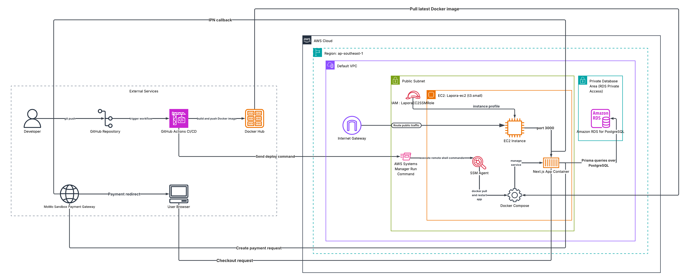

# LAPORA - Fullstack Laptop E-commerce



LAPORA is a fullstack laptop e-commerce project built with Next.js, Prisma,
PostgreSQL and Docker.

The project focuses on core e-commerce workflows: product browsing,
authentication, shopping cart, checkout, order tracking, COD payment, MoMo
sandbox payment, and a basic admin dashboard.

## Tech Stack

- Frontend: Next.js, React, Tailwind CSS
- Backend: Next.js App Router, Route Handlers, Server Actions
- Database: PostgreSQL
- ORM: Prisma
- Authentication: Custom session-based authentication with HttpOnly cookies
- Payment: COD and MoMo sandbox
- DevOps: Docker, Docker Compose, GitHub Actions CI/CD, AWS EC2, AWS RDS,
  AWS Systems Manager

## Features

- User registration and login
- Session-based authentication with hashed session tokens
- Product listing with search, filter, sort and pagination
- Product detail page
- Shopping cart with quantity controls and stock validation
- Checkout with COD and MoMo sandbox payment
- Order history and order detail pages
- Admin dashboard protected by role-based authorization
- Admin order status management
- Admin product stock and visibility management
- Dockerized production build
- GitHub Actions CI/CD for typecheck, lint, Docker image build and AWS deploy
- Health check endpoint for deployment readiness

## AWS Architecture Overview

```text
User Browser
  -> Internet Gateway
  -> EC2 public subnet
  -> Docker Compose
  -> Next.js app container
  -> Prisma
  -> Amazon RDS for PostgreSQL
```

The application is deployed on an EC2 instance inside the default VPC in the
`ap-southeast-1` region. The Next.js production app runs as a Docker container
managed by Docker Compose. Public HTTP traffic reaches the EC2 instance through
the Internet Gateway and is forwarded to the container on port `3000`.

PostgreSQL is hosted on Amazon RDS instead of running as a database container on
EC2. RDS public access is disabled, and database access is restricted to the EC2
security group. The Next.js container connects to RDS through Prisma using the
production `DATABASE_URL`.

MoMo is integrated as an external payment gateway. During checkout, the app
creates a payment request to MoMo Sandbox. The user is redirected to MoMo to
complete payment, and MoMo sends an IPN callback back to the application so the
order and payment status can be updated.

Production secrets such as database URL, session cookie settings and MoMo keys
are stored in `.env.production` on the EC2 instance and are not committed to
GitHub.

## CI/CD Deployment Flow

```text
Developer
  -> git push
  -> GitHub Actions
  -> typecheck, lint, production build
  -> Docker image build
  -> push image to Docker Hub
  -> AWS Systems Manager Run Command
  -> EC2 pulls latest Docker image
  -> Docker Compose recreates Next.js container
  -> health check verifies /api/health
```

GitHub Actions is used for both CI and CD. On every push to the main branch, the
workflow installs dependencies with `npm ci`, generates the Prisma Client, runs
TypeScript type checking, runs ESLint and builds the Next.js production app.

After the application passes the build checks, GitHub Actions builds a Docker
image and pushes it to Docker Hub. The EC2 instance does not build the project
itself, which keeps memory usage lower and makes deployment more stable on a
small server.

For deployment, GitHub Actions sends a command to EC2 through AWS Systems
Manager instead of opening SSH access to GitHub runner IP addresses. The SSM
agent on EC2 receives the command, pulls the latest Docker image from Docker
Hub, recreates the app container with Docker Compose, and then checks
`/api/health` to confirm that the application can connect to the database.

This deployment model keeps the database private, avoids storing SSH keys in the
deployment workflow, and separates responsibilities clearly:

- GitHub Actions builds and publishes the image.
- Docker Hub stores the deployable application image.
- AWS Systems Manager triggers remote deployment on EC2.
- EC2 runs the application container.
- Amazon RDS stores persistent application data.

## Authentication Overview

This project uses a stateful session model instead of long-lived stateless JWTs.

```text
Login
  -> create random session token
  -> store token hash in database
  -> send raw token to browser as HttpOnly cookie

Request
  -> read cookie
  -> hash token
  -> find matching session in database

Logout
  -> delete current session from database
  -> delete browser cookie
```

This allows the server to revoke a session immediately when the user logs out.

## Local Development

### 1. Install dependencies

```bash
npm install
```

### 2. Start PostgreSQL

```bash
docker compose up -d
```

### 3. Configure environment variables

Create a `.env` file in the project root.

```env
DATABASE_URL=""
APP_URL="http://localhost:3000"
SESSION_COOKIE_NAME=""

MOMO_PARTNER_CODE="MOMO"
MOMO_ACCESS_KEY="your_access_key"
MOMO_SECRET_KEY="your_secret_key"
MOMO_ENDPOINT="https://test-payment.momo.vn/v2/gateway/api/create"
```

### 4. Run database migrations

```bash
npx prisma migrate dev
```

### 5. Generate Prisma Client

```bash
npx prisma generate
```

### 6. Import product data

```bash
npm run import:products
```

### 7. Start the development server

```bash
npm run dev
```

Open the application at:

```text
http://localhost:3000
```

## Docker Local Test

Build the production image:

```bash
docker build -t lapora-app .
```

Run the container:

```bash
docker run -d --name lapora_next --env-file .env.docker -p 3000:3000 lapora-app
```

Check app health:

```bash
curl -i http://localhost:3000/api/health
```

Expected response:

```json
{
  "status": "ok",
  "database": "connected"
}
```

During development, use `npm run dev` for hot reload. Docker is mainly used to
test the production-like image before deployment.

## CI/CD

GitHub Actions is configured to run on push and pull request.

The pipeline currently checks:

- Dependency installation with `npm ci`
- Prisma Client generation
- TypeScript type checking
- ESLint
- Next.js production build
- Docker image build and push
- AWS SSM deployment to EC2
- Deployment health check

The deployed application runs on EC2, while PostgreSQL runs on Amazon RDS.

## Useful Commands

```bash
npm run dev
npm run build
npm run lint
npx tsc --noEmit
npx prisma studio
docker compose up -d
docker compose down
```

## Project Status

Current status:

- Fullstack core features completed
- Product import flow completed
- Authentication and authorization completed
- Cart, checkout and order flow completed
- MoMo sandbox integration completed
- Admin dashboard and management pages completed
- Docker and CI/CD pipeline completed
- AWS EC2 and RDS deployment completed

Next planned work:

- Add HTTPS and domain name
- Move public traffic behind Nginx or a load balancer
- Improve monitoring and deployment documentation
